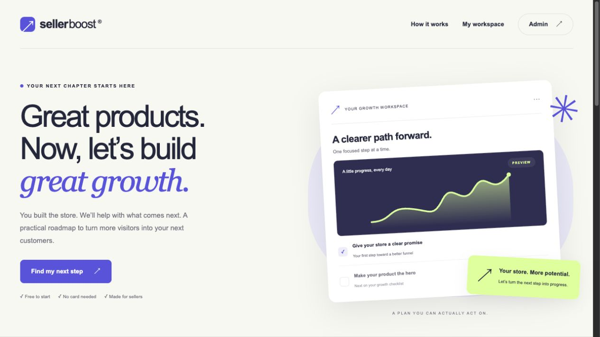
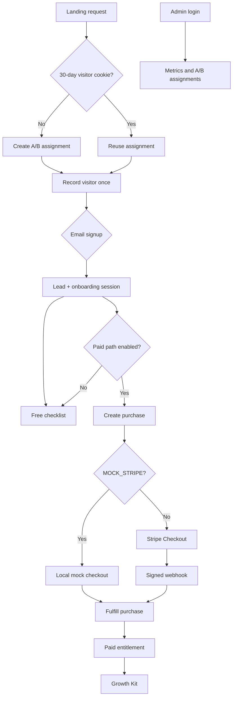

# SellerBoost Funnel

SellerBoost is a Laravel 11 MVP for an e-commerce growth funnel: a public A/B-tested landing page, free onboarding, a paid Growth Kit, Stripe Checkout, webhook fulfillment, and an authenticated admin metrics view.



See the [admin dashboard screenshot](docs/screenshots/admin.png) and [mobile screenshot](docs/screenshots/mobile.png).

## Stack

- PHP 8.3 and Laravel 11 (the lock file currently resolves Laravel 11.56.1)
- PostgreSQL 16 in Docker Compose
- Blade, Alpine.js, Vite, and project-owned CSS (Blade was chosen over React to keep the MVP scope tight)
- Stripe Checkout and Stripe webhooks, with offline mock mode enabled by default
- PHPUnit, Laravel Pint, and GitHub Actions

## Architecture

The browser receives an encrypted `sb_visitor` cookie that points to an `assignments` row. The assignment is retained for 30 days and chooses variant A or B. A browser session stores the lead id after signup; the email is contact data and is never used as login identity. Analytics events are unique per assignment and event type, so repeated refreshes do not inflate funnel counts.

The free path ends at the onboarding checklist. The paid path creates a one-time USD 29.00 purchase and either redirects to Stripe Checkout or, in mock mode, to a local completion screen. Fulfillment is idempotent: it marks the purchase and lead paid, records the paid event, and safely handles Stripe retries. The `paid` middleware protects the Growth Kit route. Admin authentication is separate from seller identity and exposes aggregate metrics plus assignment records.



## Quick start (Docker)

Requirements: Docker Desktop (or a compatible Docker Compose installation).

```sh
cp .env.example .env
docker compose up --build -d
docker compose exec app php artisan migrate --seed --force
```

The default Compose URL is [http://localhost:8000](http://localhost:8000). The current demo is running at [http://localhost:8097](http://localhost:8097). If port 8000 is occupied, use:

```sh
APP_PORT=8097 APP_URL=http://localhost:8097 docker compose up --build -d
```

For the current demo port, use `APP_PORT=8097 APP_URL=http://localhost:8097` for subsequent Compose commands. To inspect logs or stop the stack:

```sh
docker compose logs -f app
docker compose down
```

The application container runs Laravel's demo `artisan serve` process on port 8000 internally. PHP and Composer are in the runtime image; Node builds the frontend in a Docker build stage, so no host PHP or Node is required. `APP_KEY` is generated automatically when the app container starts and is retained in the Docker storage volume. This is suitable for the portfolio demo; use a production web server and process manager for deployment.

## Demo flow

1. Open the landing page and submit an email.
2. Complete or save the onboarding checklist.
3. Choose **Unlock the Growth Kit**.
4. With the default `MOCK_STRIPE=true`, complete the local mock payment.
5. Confirm the success page, then open the paid Growth Kit.
6. Open `/admin/login` and sign in with the demo admin credentials to inspect funnel metrics and A/B assignments.

The lead session lasts 120 minutes. The encrypted visitor cookie lasts 30 days. If the session expires, entering the same email again from the same browser cookie can return to that lead; seller email is not an authentication mechanism.

## Demo credentials

The seed creates the admin account:

```text
Email:    admin@sellerboost.test
Password: DemoSellerBoost!2026
```

Open `/admin/login` to view the dashboard. Seeding is idempotent: if the configured admin email already exists, the seed does not reset its password. Override `ADMIN_EMAIL` and `ADMIN_PASSWORD` before the first seed if needed; passwords must be at least 12 characters.

## Configuration

`.env.example` is configured for the offline path:

```dotenv
MOCK_STRIPE=true
PAID_PATH_ENABLED=true
```

`PAID_PATH_ENABLED=false` hides the paid offer and blocks new checkout routes, including mock completion, while leaving the existing paid Growth Kit and Stripe webhook available. Metrics are funnel counts, not revenue reporting.

Seller identity uses the browser session plus the encrypted visitor cookie. Email is not a login, there is no password recovery or email delivery. Use a private window or fresh browser profile for an independent demo; a fresh session alone does not replace the retained visitor cookie.

## Stripe test mode

Mock Stripe is the default and needs no credentials. To exercise the real integration, use Stripe test-mode credentials only:

1. Set `MOCK_STRIPE=false` and `PAID_PATH_ENABLED=true`.
2. Set `STRIPE_SECRET=sk_test_...` and a one-time USD price id in `STRIPE_PRICE_ID` (the application amount is USD 2900 cents / $29.00).
3. Forward local events with Stripe CLI. Use the current `APP_URL` when choosing the forwarding URL:

   ```sh
   stripe listen --forward-to http://localhost:8097/stripe/webhook
   ```

   Copy the CLI `whsec_...` value into `STRIPE_WEBHOOK_SECRET`.
4. Restart the application after changing environment values. With Compose, `docker compose up -d --force-recreate app` ensures the container receives them.
5. Open Checkout from the application and complete it with Stripe test card `4242 4242 4242 4242`, any future expiry date, and any CVC. The webhook must arrive before the paid entitlement is unlocked.

The webhook verifies the signature, Checkout mode, session metadata, client reference, amount, and currency before fulfillment. Duplicate event ids are ignored. Unknown sessions return HTTP 409 so Stripe can retry after a race with Checkout persistence. Live-mode events are rejected. Existing paid records remain usable even when the paid feature flag is later disabled.

## Tests and quality checks

SQLite tests use the default `phpunit.xml`. PostgreSQL tests use `phpunit.postgres.xml`, targeting a dedicated `sellerboost_test` database; do not point them at the demo database.

```sh
# SQLite suite
docker compose exec app php artisan test

# Create the dedicated PostgreSQL test database once
docker compose exec db createdb -U sellerboost sellerboost_test

# Dedicated PostgreSQL suite
docker compose exec app vendor/bin/phpunit --configuration=phpunit.postgres.xml

# Formatting check
docker compose exec app vendor/bin/pint --test
```

CI runs the frontend build (`npm run build`), tests, and Pint.

## Security and production notes

Laravel is locked to the Laravel 11 line. `composer config.audit.block-insecure=false` is present because the mandatory Laravel 11 install currently reports three advisories in `composer audit`: `PKSA-m5cs-t1y6-qpcs` (temporary signed URL behavior, unused by this app), `PKSA-3r5d-mb8f-1qw9`, and `PKSA-mdq4-51ck-6kdq` (email CRLF concerns). Application email validation explicitly rejects control characters and uses `email:rfc`; the app sends no email. Upgrade to a supported Laravel release before production use and re-enable strict audit blocking when the dependency policy allows it.

This repository is an offline-capable portfolio MVP. Do not use mock mode for live payments, commit `.env` or Stripe secrets, or treat the `artisan serve` container as a production deployment. Stripe test keys must begin with `sk_test_`.

## Scope

Included: landing A/B assignment, once-per-visitor analytics, free signup and checklist, paid entitlement, mock/Stripe checkout, signed webhook fulfillment, admin metrics, feature flags, Compose, tests, and CI. Full marketplace functionality, WordPress, and a real Shopify App Store submission are outside this MVP.
